<div align="center">

# CCTV Unified Monitor Dashboard


</div>

# Project Overview

CCTV Unified Monitor Dashboard is a modern real-time surveillance and monitoring platform designed for centralized CCTV management, incident monitoring, alert tracking, geo-mapping, and analytics reporting.

The platform simulates enterprise-level CCTV infrastructure management systems commonly used in smart cities, IT monitoring centers, transportation systems, and government surveillance operations.

---

# Live Dashboard

The central monitoring dashboard used for real-time camera analytics, alert management, and zone monitoring.

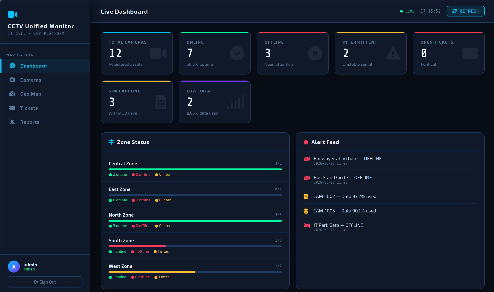

---

# Core Features

- Real-time CCTV monitoring dashboard
- Live camera status tracking
- Zone-based monitoring system
- Incident & ticket management
- Geo-location mapping
- Alert feed monitoring
- Camera uptime analytics
- Offline/intermittent camera detection
- Reports & analytics dashboard
- Modern responsive UI
- Administrative monitoring controls

---

# Camera Monitoring System

Displays live camera monitoring panels, camera statuses, and surveillance controls.

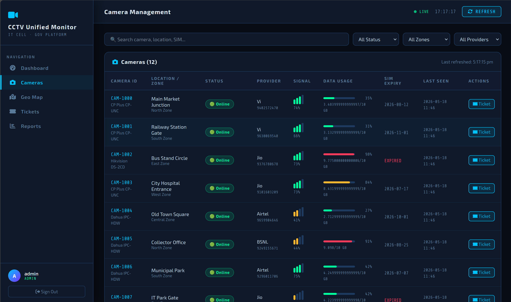

---

# Geo Mapping System

Visualizes surveillance locations and monitoring zones through integrated geo-mapping functionality.

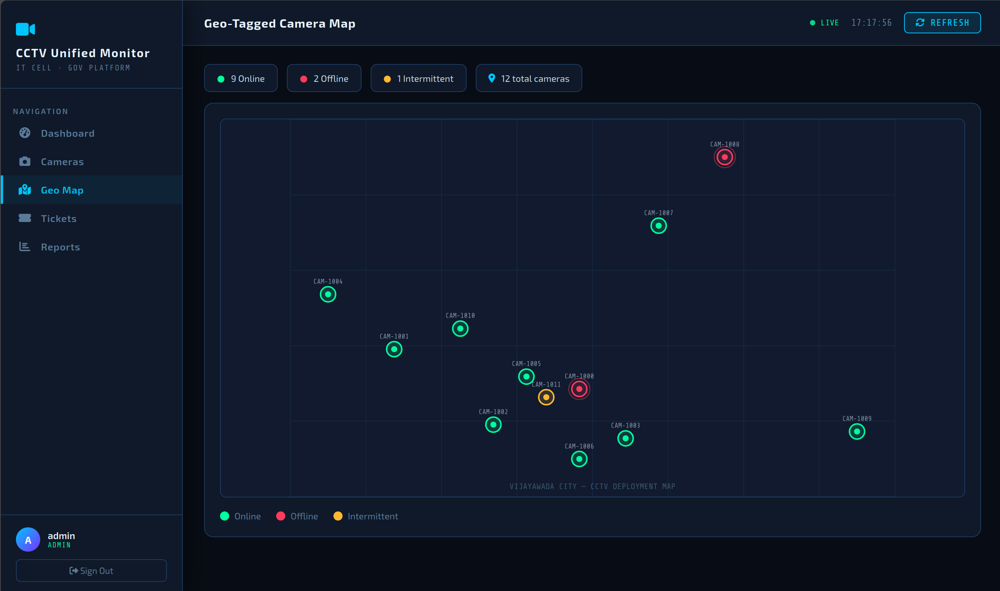

---

# Incident & Ticket Management

Tracks incidents, camera failures, alerts, and operational issues through a ticket management system.

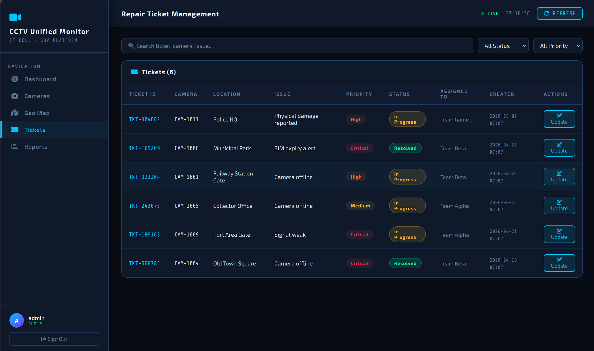

---

# Analytics & Reports Dashboard

Displays monitoring analytics, uptime statistics, camera reports, and operational insights.

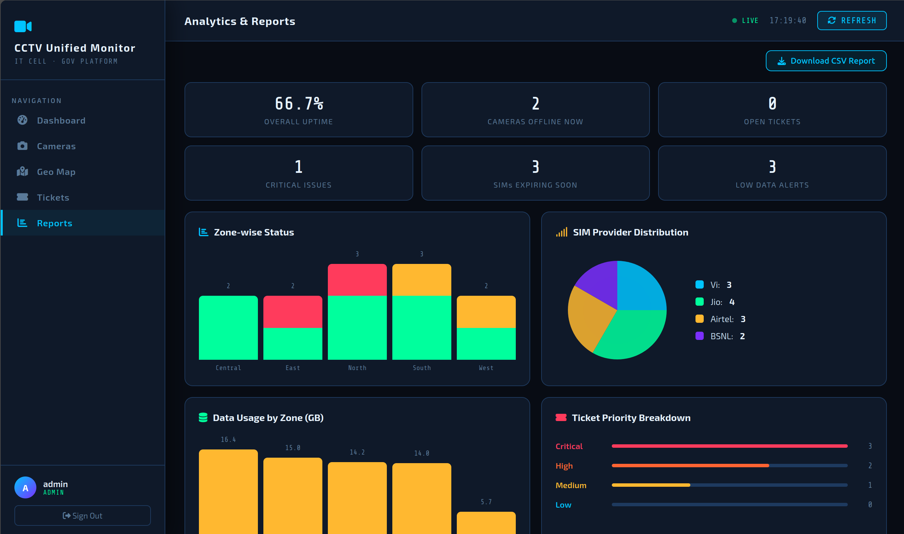

---

# Alert Feed Monitoring

Real-time alert feed used to track critical events, offline cameras, and monitoring issues.

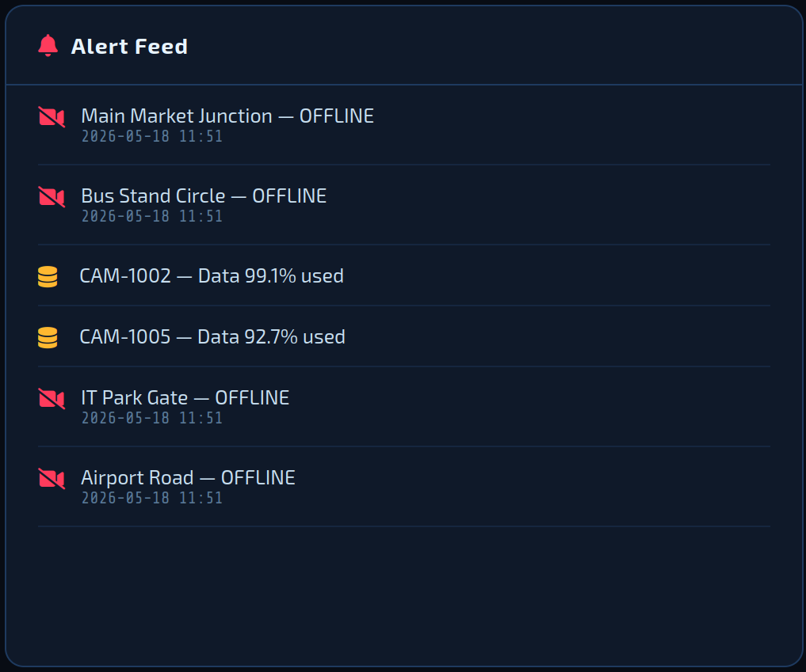

---

# Zone Monitoring System

Shows operational status of surveillance zones and camera distribution across multiple locations.

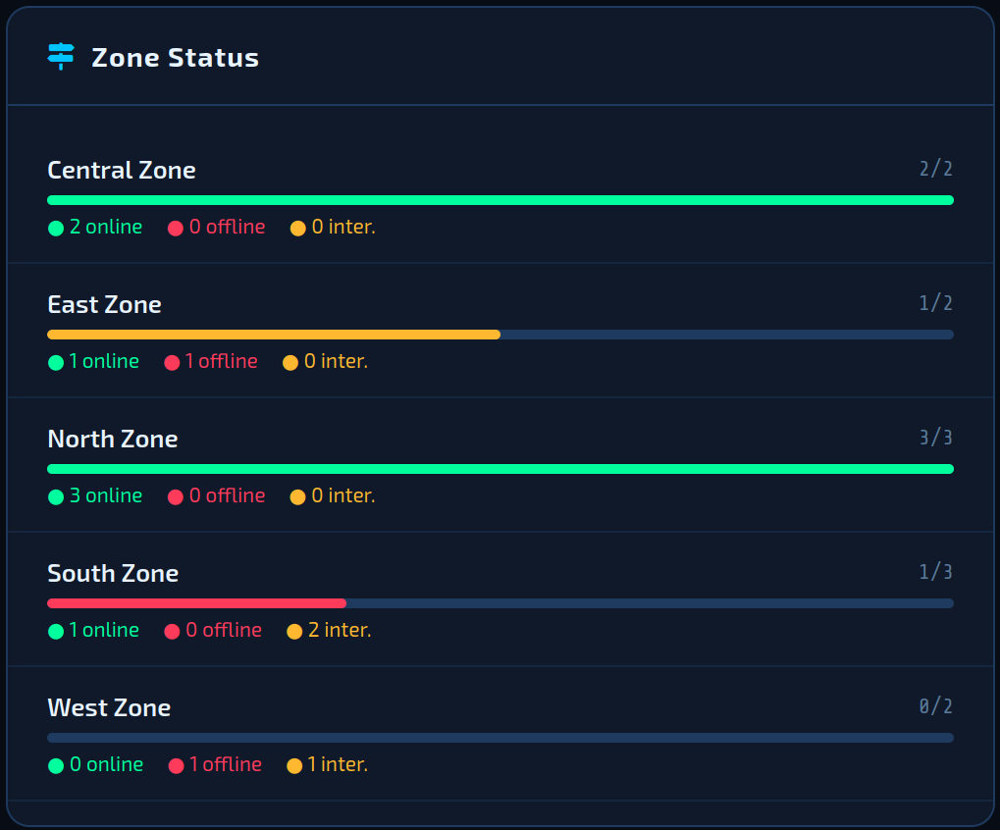

---

# Responsive Mobile Dashboard

Responsive mobile-friendly version of the monitoring dashboard.

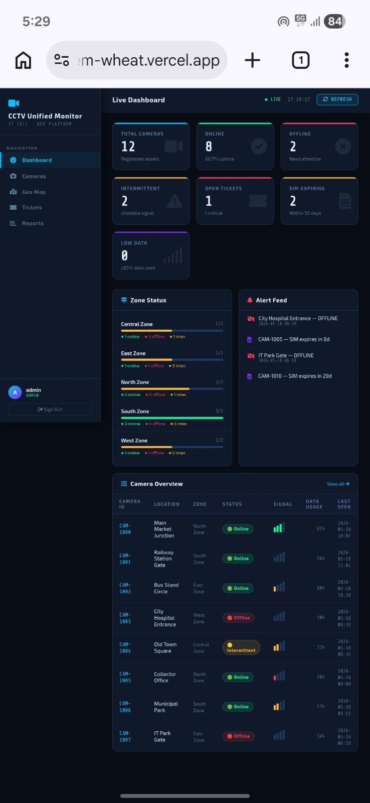

---

# Backend Execution

Backend services and monitoring systems running successfully.

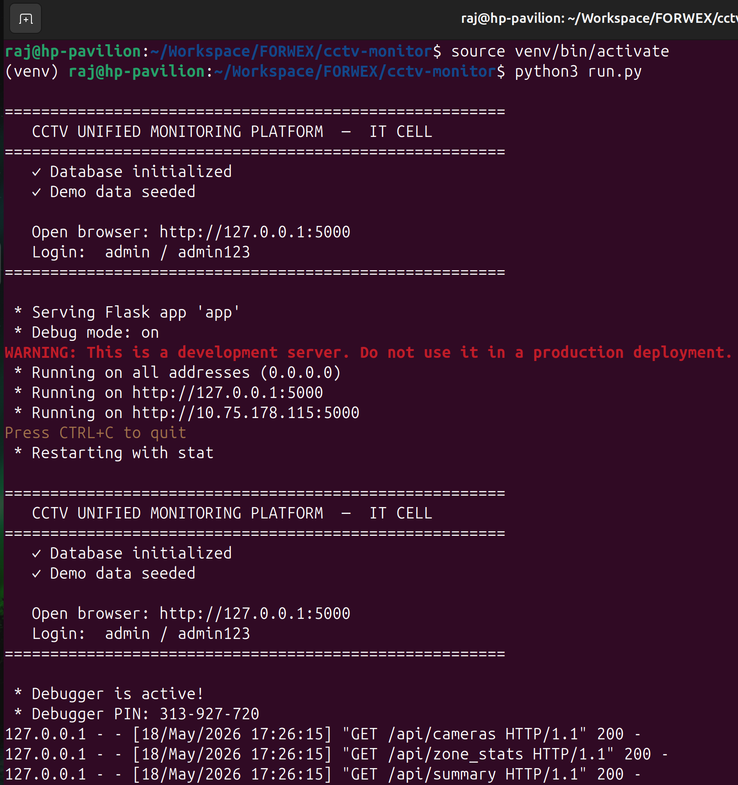

---

# System Architecture

High-level workflow and architecture of the CCTV monitoring platform.

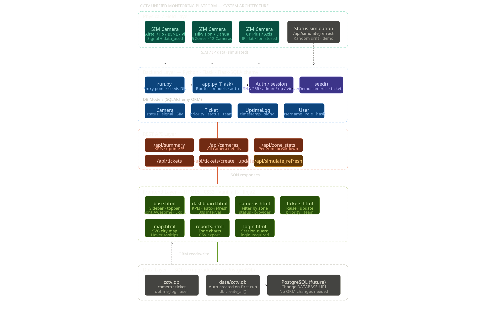

---

# Application Demo

Animated demonstration of dashboard monitoring, analytics tracking, geo mapping, and incident management workflows.

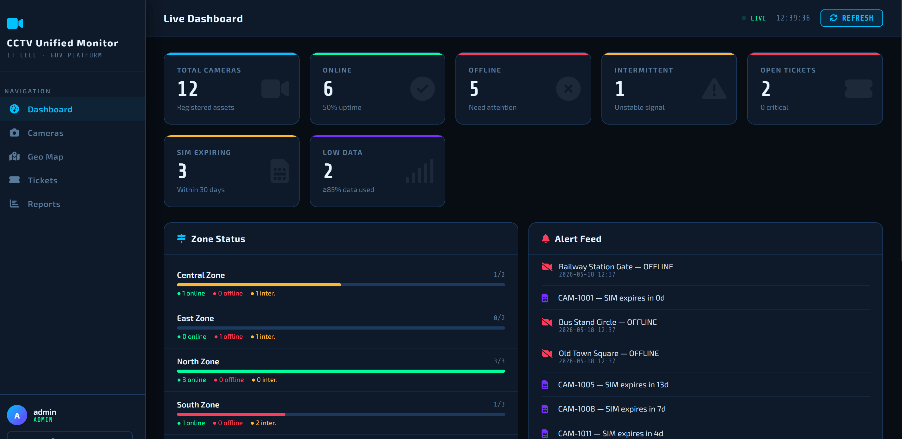

---

# Technology Stack

## Frontend
- HTML5
- CSS3
- JavaScript

## Backend
- Python
- Flask

## Dashboard Components
- Real-Time Monitoring
- Analytics Dashboard
- Incident Tracking
- Alert Feed System

## Monitoring Features
- CCTV Monitoring
- Geo Mapping
- Zone Analytics
- Ticket Management

---

# Workflow

```text
CCTV Cameras
 ↓
Monitoring System
 ↓
Flask Backend
 ↓
Alert Engine
 ↓
Geo Mapping
 ↓
Dashboard Analytics
 ↓
Reports & Tickets
```

---

# Use Cases

- Smart city monitoring systems
- Transportation surveillance dashboards
- Enterprise CCTV management
- IT monitoring centers
- Security analytics systems
- Incident management workflows
- Government surveillance simulations

---

# Folder Structure

```text
CCTV-Unified-Monitor/
│
├── screenshots/
│   ├── 01_main_dashboard.png
│   ├── 02_camera_monitoring.png
│   ├── 03_geo_map.png
│   ├── 04_incident_tickets.png
│   ├── 05_reports_dashboard.png
│   ├── 06_alert_feed.png
│   ├── 07_zone_monitoring.png
│   ├── 08_mobile_dashboard.png
│   ├── 09_backend_running.png
│   ├── 10_system_architecture.png
│   └── 11_demo.gif
│
├── templates/
├── static/
├── README.md
├── requirements.txt
└── app.py
```

---

# Installation

## Clone Repository

```bash
git clone <your-repository-url>
```

---

## Navigate to Project Directory

```bash
cd CCTV-Unified-Monitor
```

---

## Install Dependencies

```bash
pip install -r requirements.txt
```

---

## Run Application

```bash
python app.py
```

## DEFAULT LOGIN CREDENTIALS

| Username | Password  |   Role   |
|----------|-----------|----------|
| admin    | admin123  | Admin    |
| operator | op123     | Operator |
| viewer   | view123   | Viewwer  |

---

# Future Improvements

- AI-based threat detection
- Real-time video streaming
- Face recognition integration
- Cloud monitoring support
- SMS/email alert notifications
- Multi-admin support
- Camera recording playback
- Advanced analytics engine
- Mobile application integration

---

# Author

Rajkumar Kalapala

Cybersecurity & AI Enthusiast  
Python Developer | Monitoring Systems | Dashboard Engineering

- Live Demo: https://cctv-monitoring-system-wheat.vercel.app

---

# License

This project is created for educational and demonstration purposes.
