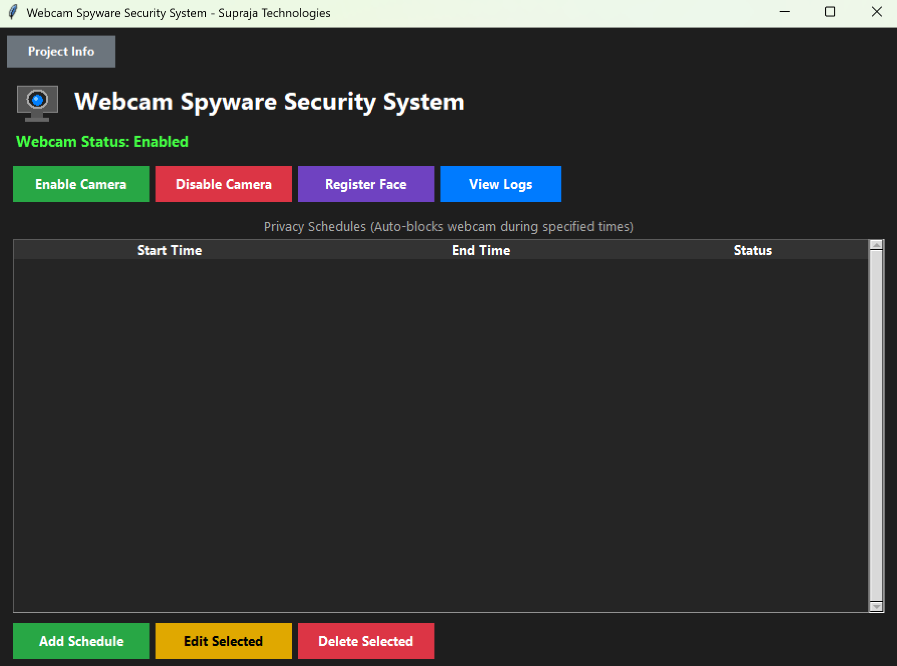
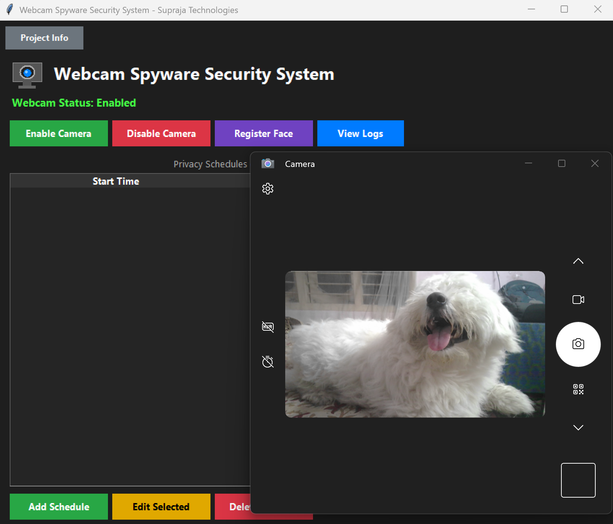
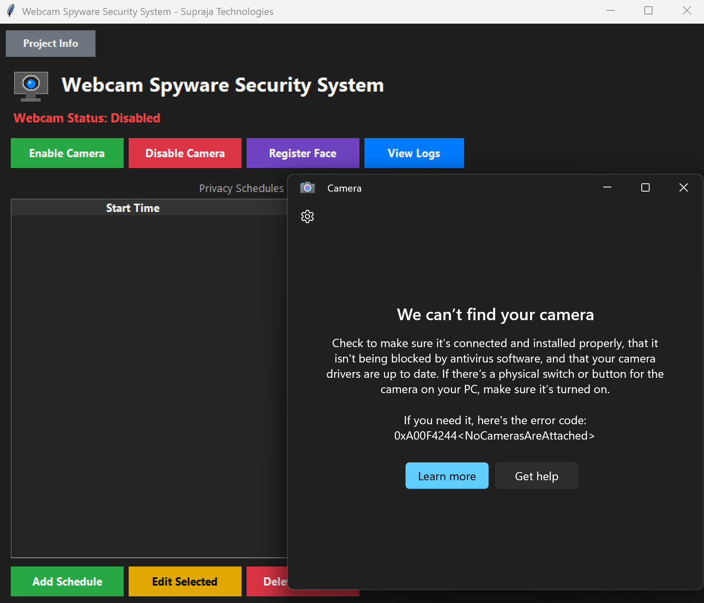
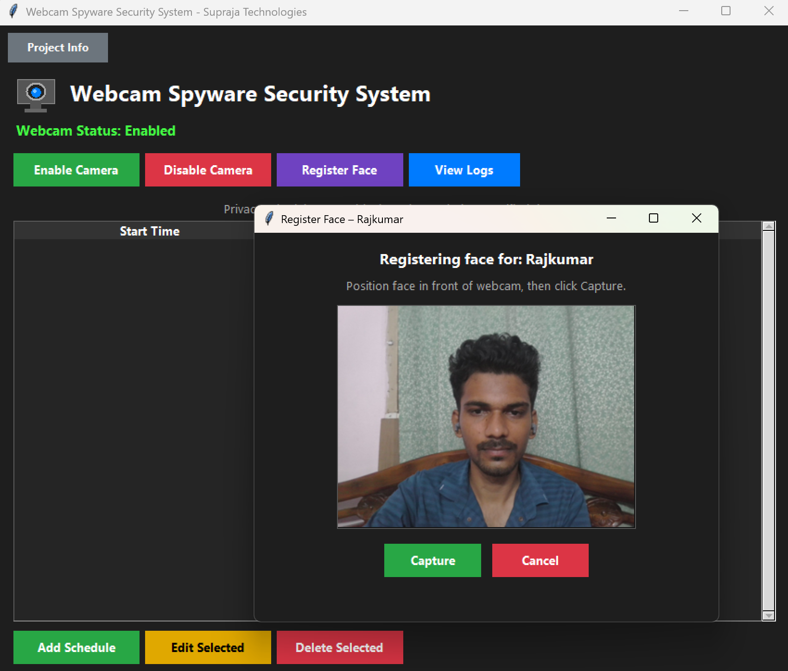
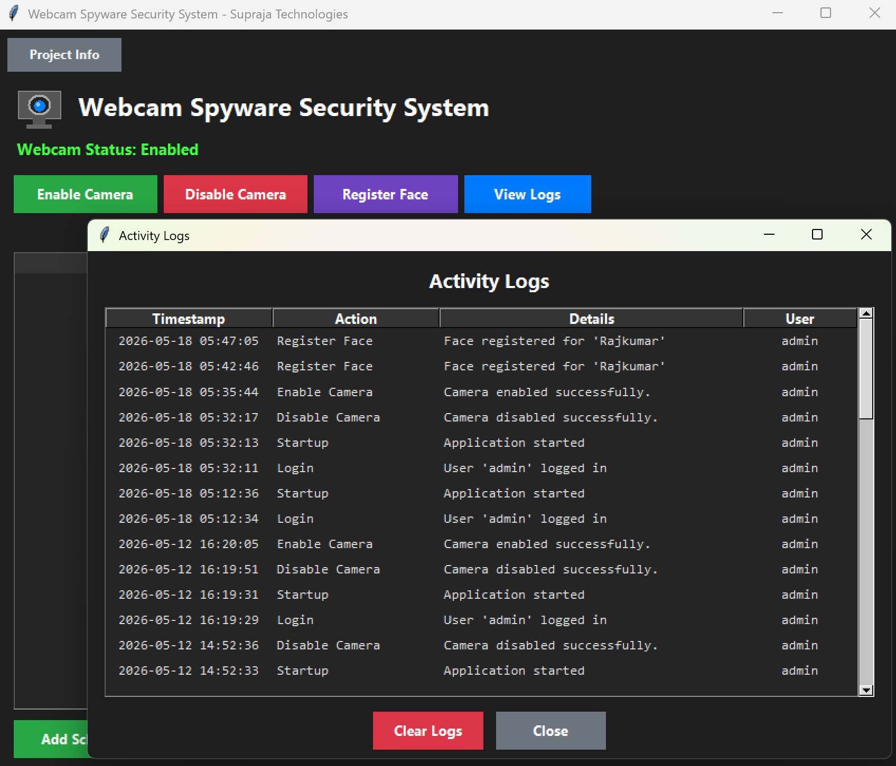
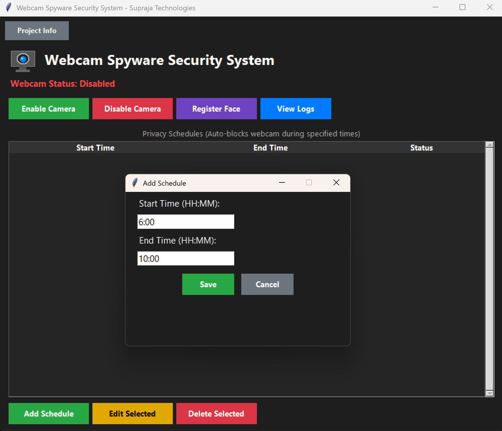
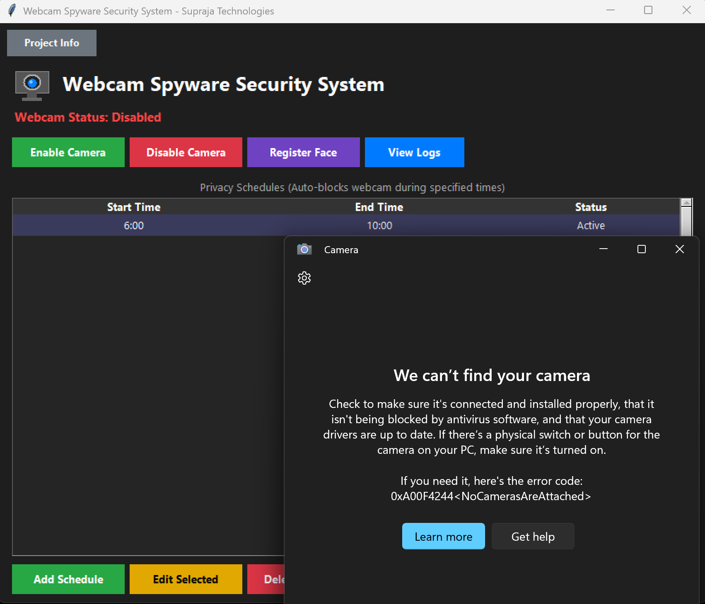
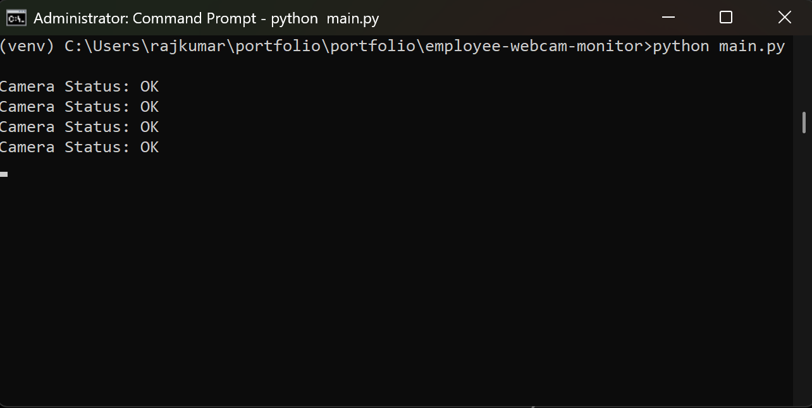
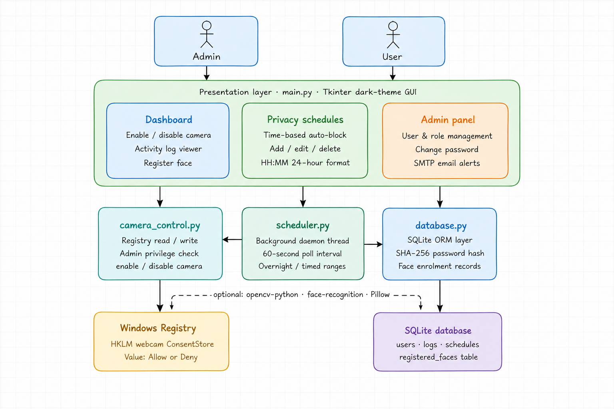
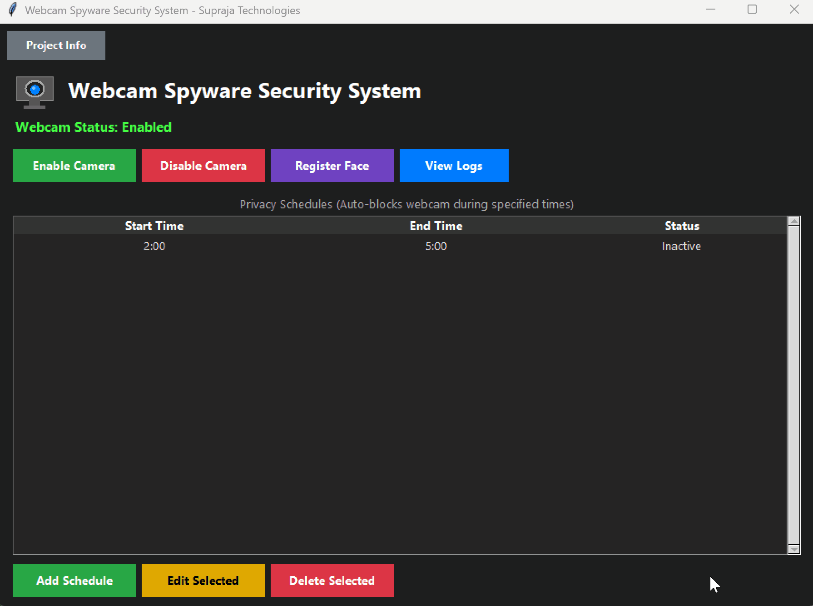

<h1 align="center">
  Webcam Spyware Security System
</h1>

<p align="center">
  

  

  
</p>

<p>
  A cybersecurity-focused desktop application designed to monitor, control,
  and protect webcam privacy using scheduling, face registration,
  activity logging, and security alerts.
</p>

---

# Project Overview

The Webcam Spyware Security System is a privacy and security-oriented desktop application built to help users monitor webcam activity, control unauthorized access, and automate privacy protection using schedules and face registration mechanisms.

The system simulates real-world webcam protection and monitoring concepts commonly used in cybersecurity and endpoint security applications.

---

# Key Features

- Enable / Disable webcam access
- Privacy scheduling system
- Face registration functionality
- Webcam monitoring controls
- Security event logging
- Activity tracking
- Automated privacy protection
- User-friendly desktop interface
- Security-focused dark UI

---

# Main Dashboard

The primary control panel for managing webcam security and privacy operations.



---

# Webcam Monitoring Enabled

Demonstrates active webcam access and monitoring functionality.



---

# Webcam Protection / Disabled State

Shows webcam blocking and privacy protection functionality.



---

# Face Registration System

Allows users to register authorized faces for security verification and monitoring.



---

# Security Activity Logs

Displays webcam activity logs, monitoring records, and security events.



---

# Privacy Schedule Configuration

Users can configure automated webcam privacy schedules.



---

# Privacy Scheduling System

Shows active privacy schedules configured for automatic webcam protection.



---

# Backend Execution

Backend services and monitoring systems running successfully.



---

# System Architecture

High-level workflow and architecture of the Webcam Spyware Security System.



---

# Application Demo

Animated demo showcasing the complete workflow of the system.



---

# Technology Stack

## Programming Language

- Python

## GUI Framework

- Tkinter

## Computer Vision

- OpenCV

## Security Concepts

- Webcam Monitoring
- Privacy Protection
- Access Control
- Activity Logging

## Storage

- SQLite / Local Storage

---

# Workflow

```text
User
 ↓
Desktop GUI
 ↓
Webcam Controller
 ↓
Face Registration
 ↓
Privacy Scheduler
 ↓
Security Logs
 ↓
Monitoring System
```

---

# Use Cases

- Webcam privacy protection
- Cybersecurity demonstrations
- Endpoint monitoring simulations
- Educational security projects
- Unauthorized webcam access prevention
- Privacy management automation

---

# Future Improvements

- AI-based threat detection
- Cloud synchronization
- Email/SMS alerts
- Multi-user authentication
- Advanced intrusion detection
- Real-time notification system
- Mobile companion dashboard

---

# Folder Structure

```text
Webcam-Spyware-Security-System/
│
├── screenshots/
│   ├── 01_main_dashboard.png
│   ├── 02_camera_enabled.png
│   ├── 03_camera_disabled.png
│   ├── 04_face_registration.png
│   ├── 05_security_logs.png
│   ├── 06_schedule_config.png
│   ├── 07_privacy_schedules.png
│   ├── 08_backend_running.png
│   ├── 09_system_architecture.png
│   └── 10_demo.gif
│
├── src/
├── README.md
└── requirements.txt
```

---

# Installation

## Clone Repository

```bash
git clone https://github.com/RajkumarKalapala/portfolio.git
```

## Navigate to Project

```bash
cd Webcam-Spyware-Security-System
```

## Install Dependencies

```bash
pip install -r requirements.txt
```

## Run Application

```bash
python main.py
```

## Default Login
| Username | Password  | Role  |
|----------|-----------|-------|
| admin    | Admin@123 | Admin |

---

# Author

Rajkumar Kalapala

Cybersecurity & AI Enthusiast  
Python Developer | Security Projects | Monitoring Systems

---

# License

This project is created for educational and demonstration purposes.
