<h1 align="center">
  USBLOCKR — USB Security Dashboard
</h1>

<p align="center">
  

  

  

  

  
</p>

---

# Project Overview

USBLOCKR is a cybersecurity-focused desktop application designed to monitor, control, and secure USB ports using access control, whitelist management, OTP/email alerts, activity logging, and administrative monitoring.

The application simulates real-world endpoint security and USB protection systems commonly used in enterprise cybersecurity environments to prevent unauthorized device access and improve system security.

---

# Main Dashboard

The primary security dashboard used to manage USB ports, monitoring operations, alerts, and administrative controls.

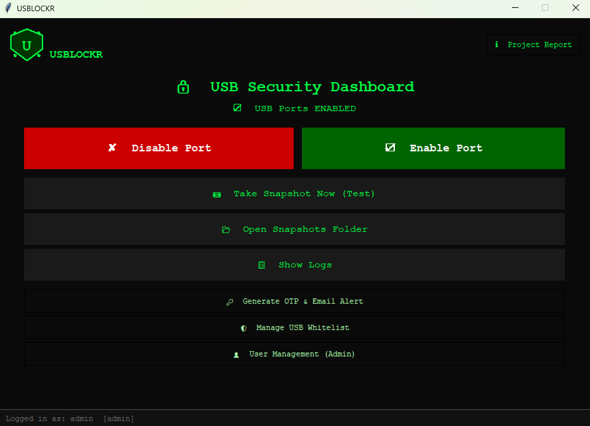

---

# Core Features

- Enable / Disable USB ports
- USB access control system
- Security activity logging
- OTP & email alert generation
- USB whitelist management
- Snapshot capture system
- Administrative controls
- Endpoint monitoring
- User authentication support
- Cybersecurity-focused dark UI

---

# USB Port Security Control

## USB Ports Disabled

Demonstrates active USB blocking and access restriction.

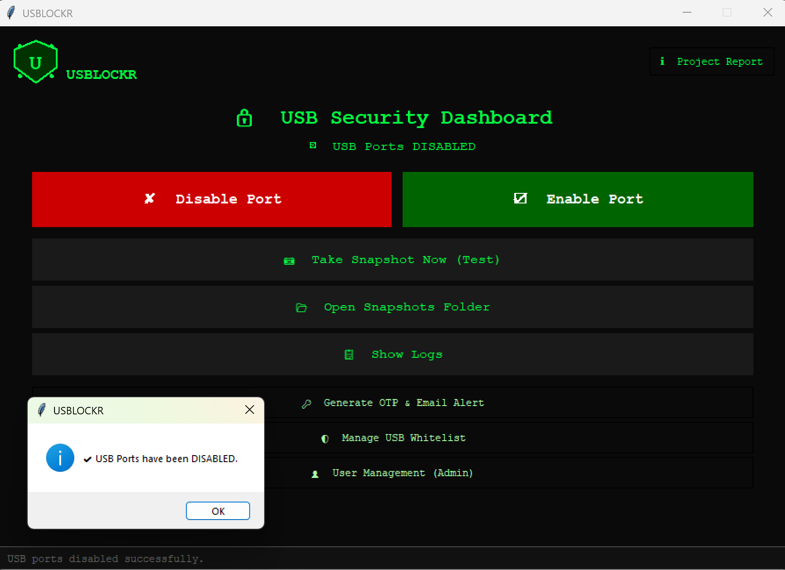

---

## USB Ports Enabled

Shows active USB access and monitoring functionality.

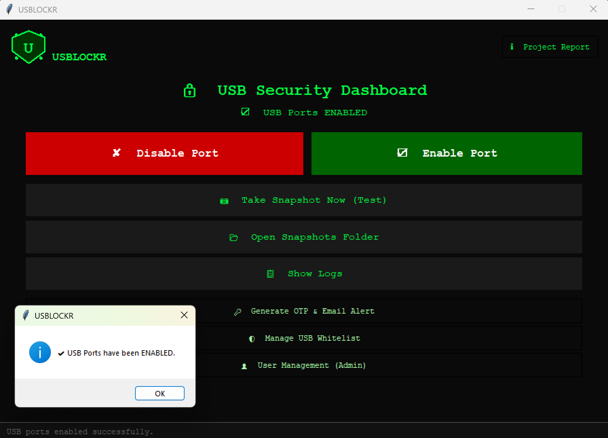

---

# Security Activity Logs

Displays security events, monitoring activity, access records, and USB-related operations.

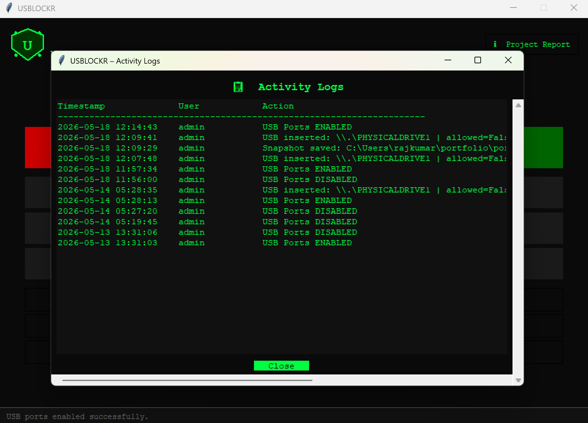

---

# OTP & Email Alert System

Generates OTP-based verification and email notifications for security monitoring and alert management.

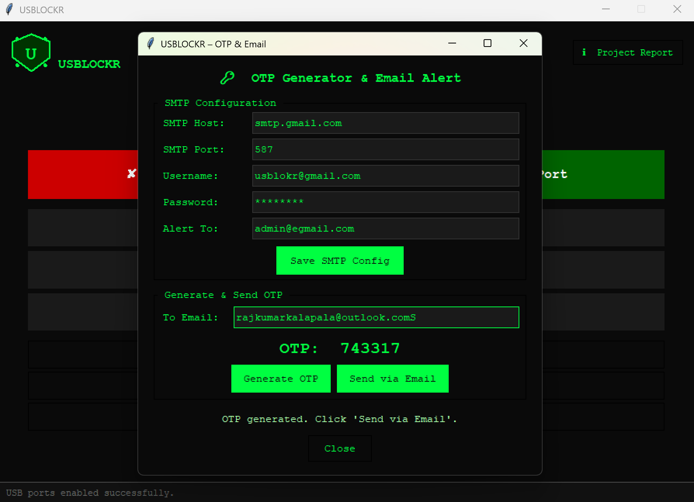

---

# USB Whitelist Management

Allows administrators to manage trusted USB devices and restrict unauthorized access.

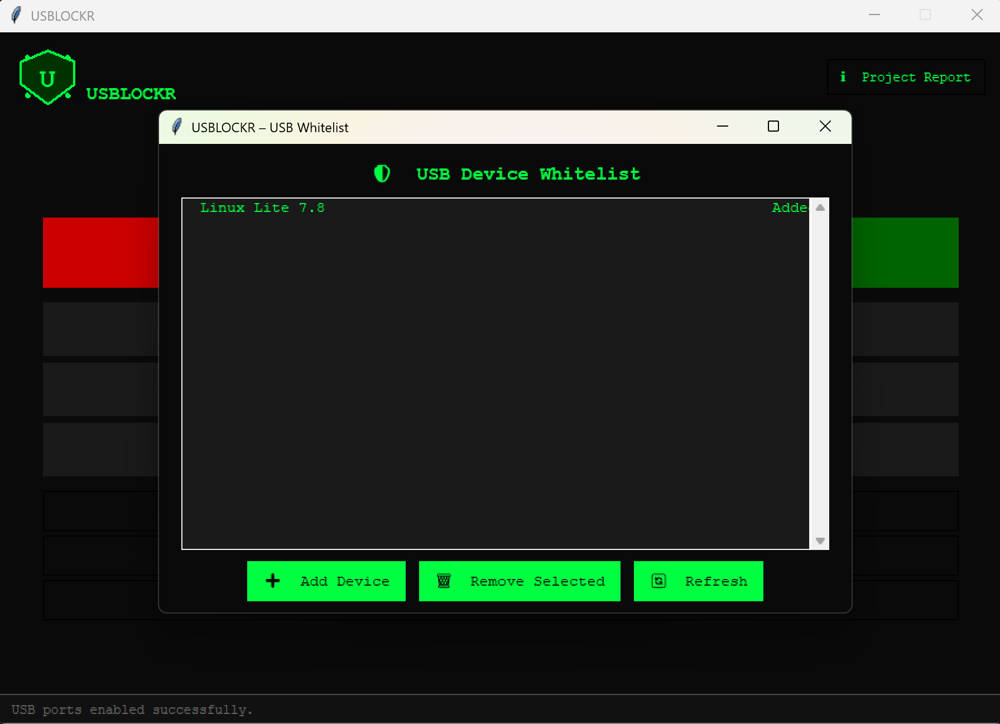

---

# User Management (Admin Panel)

Administrative control panel used for managing users, permissions, and security settings.

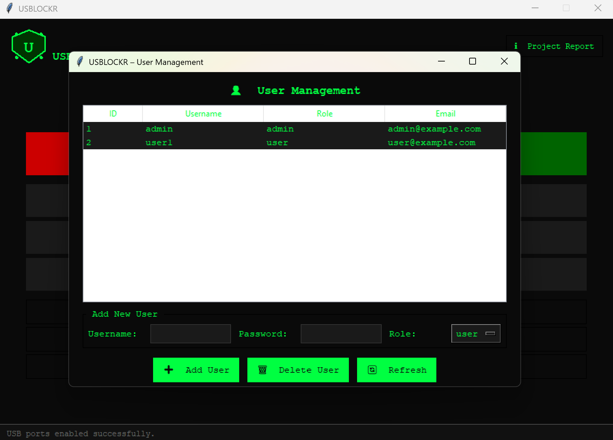

---

# Monitoring Snapshots

Displays captured monitoring snapshots and security evidence generated by the system.

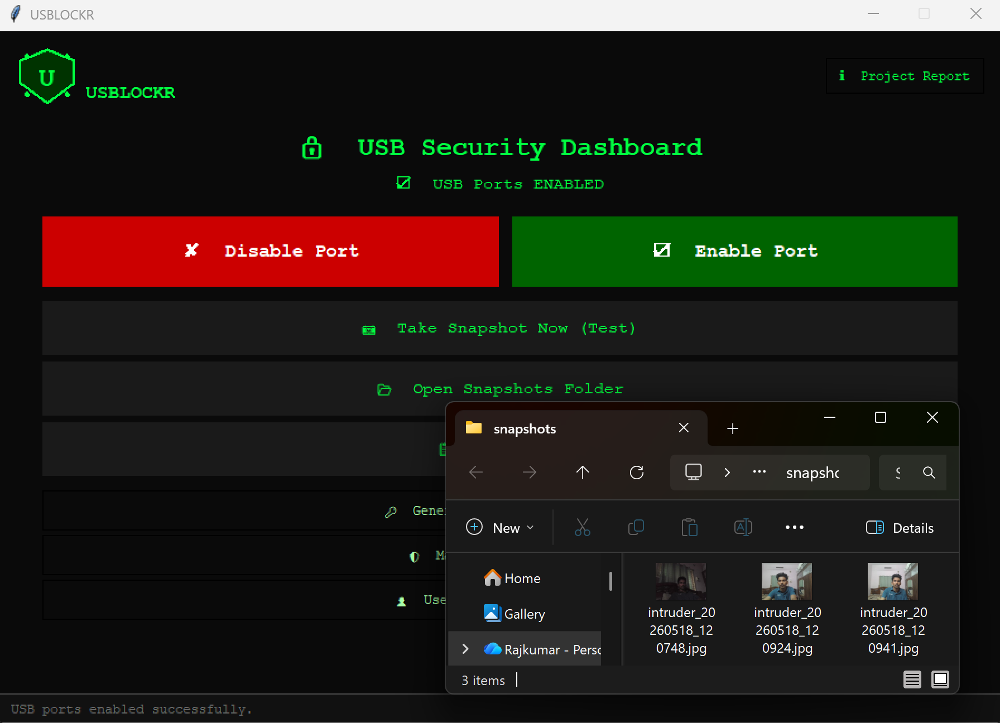

---

# Backend Execution

Backend monitoring services and USB security systems running successfully.

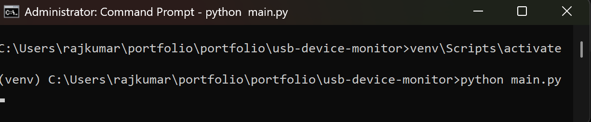

---

# System Architecture

High-level workflow of the USBLOCKR monitoring and security system.

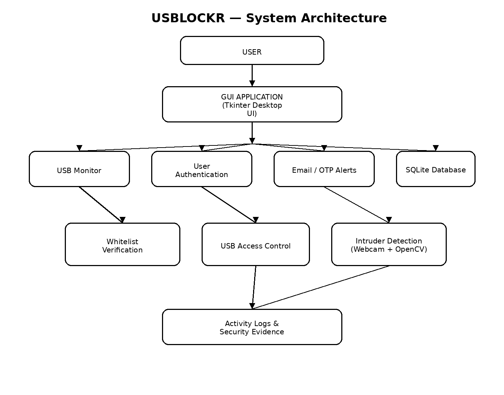

---

# Application Demo

Animated demonstration of USBLOCKR functionalities including USB monitoring, alerts, whitelist management, and security controls.

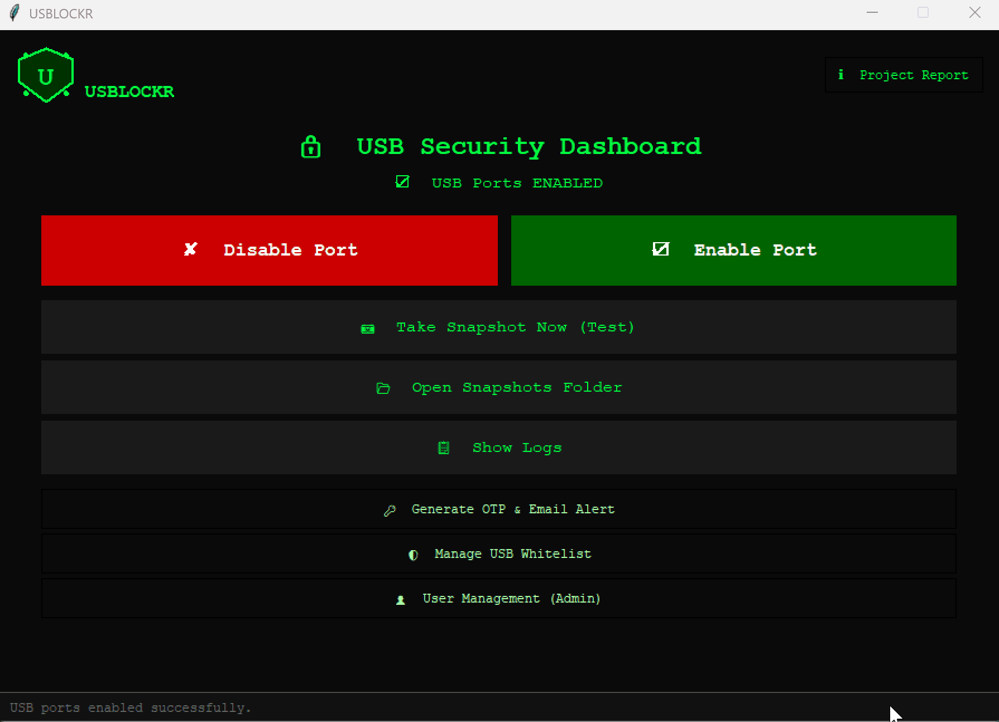

---

# Technology Stack

## Programming Language
- Python

## GUI Framework
- Tkinter

## Security Features
- USB Monitoring
- Endpoint Security
- Access Control
- Device Validation
- Activity Logging
- OTP Verification

## Additional Functionalities
- Email Alert System
- Snapshot Capture
- Administrative Controls

---

# Workflow

```text
User
 ↓
USBLOCKR Dashboard
 ↓
USB Port Controller
 ↓
Security Validation Engine
 ↓
Whitelist Management
 ↓
OTP & Email Alert System
 ↓
Security Logs & Monitoring
```

---

# Use Cases

- USB access control
- Endpoint security simulations
- Cybersecurity education
- Unauthorized USB prevention
- Security monitoring demonstrations
- Administrative device management
- System protection workflows

---

# Folder Structure

```text
USBLOCKR/
│
├── screenshots/
│   ├── 01_main_dashboard.png
│   ├── 02_usb_disabled.png
│   ├── 03_usb_enabled.png
│   ├── 04_security_logs.png
│   ├── 05_email_alert.png
│   ├── 06_whitelist_management.png
│   ├── 07_admin_management.png
│   ├── 08_snapshots_folder.png
│   ├── 09_backend_running.png
│   ├── 10_system_architecture.png
│   └── 11_demo.gif
│
├── src/
├── README.md
├── requirements.txt
└── main.py
```

---

# Installation

## Clone Repository

```bash
git clone <your-repository-url>
```

---

## Navigate to Project Directory

```bash
cd USBLOCKR
```

---

## Install Dependencies

```bash
pip install -r requirements.txt
```

---

## Run Application

```bash
python main.py
```

## DEFAULT LOGIN CREDENTIALS

| Username | Password  | Role  |
|----------|-----------|-------|
| admin    | admin123  | Admin |
| user1    | user123   | User  |

---

# Future Improvements

- AI-powered threat detection
- Real-time intrusion alerts
- Cloud synchronization
- Multi-device management
- Advanced admin roles
- Centralized monitoring dashboard
- USB encryption validation
- Real-time notification system

---

# Author

Rajkumar Kalapala

Cybersecurity & AI Enthusiast  
Python Developer | Security Projects | Monitoring Systems

---

# License

This project is created for educational and demonstration purposes.
